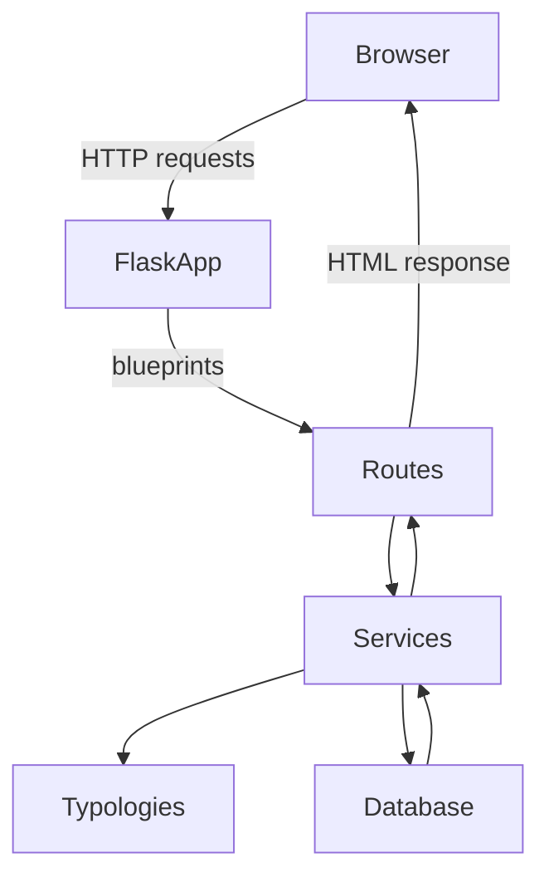
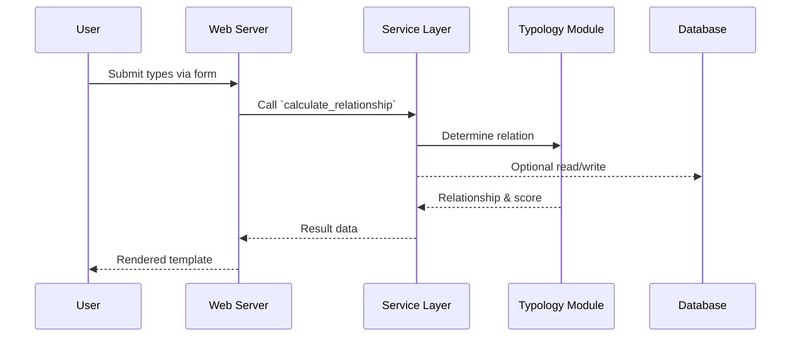

# Architecture Overview

This document explains how the components of the Psychological Calculator project interact and the flow of data through the system.

## High-Level Components

- **Flask Application Factory** (`app/__init__.py`) sets up extensions, registers blueprints and configures OAuth providers.
- **Routes / Views** (`app/routes.py` and `app/admin/`) handle user requests, render templates and invoke services.
- **Services** (`app/services.py`) encapsulate business logic such as typology calculations and user utilities.
- **Typology Modules** (`app/typologies/`) implement the rules for each typology (Temporistics, Psychosophy, etc.).
- **Database Models** (`app/models.py`) persist user accounts, type selections and OAuth tokens using SQLAlchemy.
- **Templates** (`app/templates/`) generate the HTML pages shown in the browser.

### Component Interaction

## Data Flow

1. **User request**: a browser sends an HTTP request to the Flask application (e.g. submitting two types for comparison).
2. **Routing**: the request is routed to the appropriate view function within a blueprint.
3. **Service layer**: views call helper functions in `services.py` to retrieve available types, compute compatibility and interact with the database.
4. **Typology logic**: services invoke classes in `app/typologies/` to calculate relationship types and comfort scores.
5. **Database access**: results may be stored via SQLAlchemy models in `app/models.py`.
6. **Response**: a template is rendered with the calculated data and returned to the browser.

### Sequence Diagram

These diagrams provide a starting point for understanding how the application processes requests and how data flows between components. Future microservice extraction (see `NOTE.md`) can extend this model by replacing the typology modules with API calls to dedicated services.
